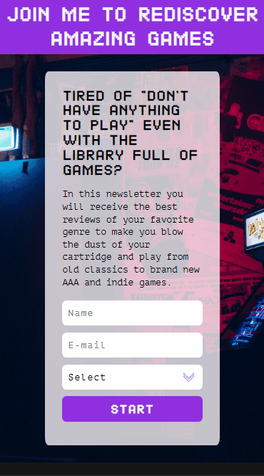

<h1 align="center">Landing Page</h1>

🛬 A landing page to delivery any sort of email to who fill the form 📄

    
    
    
    

<h2>✏️ About</h2>

In this case, I created a landing page for a fictional game reviewer, with the objective of interested people submits their favorite game genre to see reviews of the best games of the chosen genre, (re)discover classics, learn more about the gaming universe, and give a chance to independent games!   
It is a pc-mobile responsive template I've made. Then you could use it for your newsletter, workshop events, alerts... 
Feel free to fork the code and modify the info to solve your needs 😀
 

<h2>📑 Content Table</h2>
<h3 align="center">
    <a href="#%EF%B8%8F-about">About</a> • 
    <a href="#-status">Status</a> •
    <a href="#-features">Features</a> •
    <a href="#-----demo--%EF%B8%8Frun">Demo</a> •
    <a href="#%EF%B8%8F-requisites">Requisites</a> •
    <a href="#-tech-stack">Tech</a> •
    <a href="#-contribution">Contribution</a> •
    <a href="#-excelsior-code--by-luís-felipe">Ending</a>
</h3>

<h2>🧵 Status</h2>
<h4>Finished ✨</h4> 

<h2>📍 Features</h2>

- [x] E-mail capture with Mailchimp integration
- [x] Many game genres
- [x] Mobile responsively
 

<h2>
    🛬 Demo ⏩ <a href="https://luisf-csdev.github.io/landing_page/">(🕹️run)</a>
</h2>

     
    
    

##

 
<h2>♟️ Requisites</h2>
<h3>To run the page all you need to do is click in the joystick on the topic above ⬆️</h3>

* If you want to use this template for your page, you'll need to create an embedded form in MailChimp with the fields you want to, after that, copy the HTML essential info (without CSS) into the template form. After that, the integration will be complete! If you have any doubts, just get a look in the code to see what to copy from MailChimp or contact me 😃
 

<h2>💽 Tech Stack</h2>
<h3>The following languages were used to build this project:</h3>

    
    
  

<h2>💡 Contribution</h2>
<h3>
      
    This project is based in a study-code made by Igor Oliveira from ProgramadorBR FullStack
</h3>   

<h5 align="center">
    Thank you very much for reading this readme!

    <h6 align="center"> Excelsior code 🪐 by Luís Felipe</h6>
</h5>
